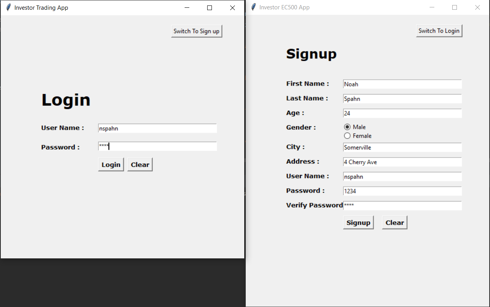

# EC500FinalApp

## Abstract

This is a trading App based on python to run backtesting simulations and become a helpful trading tool. This tool is split into three main functions. BackTesting Trade Strategies, Displaying stock data, and set stock price alert. These functions are available through a GUI menu and allow navigation between the functions. The databases used throughout this application involve CSV files for simple local storage. The dependencies used for this program have been built into a requirments.txt file for simple instantiation. The APIs used throughout this project include:

1. yfinance
2. backtrader
3. NewsAPI
4. plotly
5. dash

## *Timeline:*

- 4/14: User Stories, Functional Outline (Goal Met)
- 4/20: Skeleton Builds (Goal Met)
- 4/21: Unit Testing/Unit Functions (Finished 4/27)
- 5/1: Start Integration Testing (Working)
- 5/6: Polish App

## Step 1: Stub App

The Stub is the user stories and basic three functions outlined with how to accomplish them modularly. The initial Stub App involves

### *User Stories:*

- As a trader I want to backtest trading strategy parameters and understand how they would model future trades. I don’t want to run copious calculations and I want to compare backtests to see what gives me different buy, sell results.
- As a trader, strategy needs to be dynamic in that the tool should enable me to quickly identify multiple indicators that can indicate positive future opportunity.

### Functional Outline: *(Unit/Integration Testing)*

- BackTesting Function
  - Input Validation for Symbol - *UT*
  - Pull Symbol Data - *UT*
  - Run Simulation on Pulled Data - *IT*
  - Display Simulation Results - *IT*
- PrintCurrentData Function - *UT*
  - Input Validation for Symbol - *UT*
  - Pull Symbol Data - *UT*
  - Display Current Data - *IT*
- SetPriceAlert Function - *IT*
  - Input Validation for Symbol - *UT*
  - Pull Symbol Data - *UT*
  - Set HTTPSAlert Trigger - *UT*
  - Loop Pull StockData until Trigger - *UT*
  - Send Alert Email. - *UT*

## Update/Demo 1: (4-28-21)

At this point in development, much of the application's functionality has at least a skeleton build. The GUI leaves a lot to be desired. In the Stub, I outlined the basic functionality. Trying to build things out modularly prepares the unit tests' overall success before moving on to the integration testing. Currently, the idea is for the GUI to tie everything together with a file that can call all the functional components and save them to a database. SQL and CSV have different advantages, and the database choice will depend on where I can make the most progress on the GUI. I am currently using Tkinter to build a local experience, but I am having some issues with permissions and interacting in the database. Dash seems like an alternative that looks a lot better, and if I can implement it correctly, it provides a way to create this whole project utilizing a python framework to take care of the HTML/CSS and JS. Tkinter also has the issue that it needs to take in the current outputs from the Matlab plot, and it is not simple to integrate this visualization into an existing window. In favor of Tkinker is that Authentication is simple, and I know how to use it with a current database.

